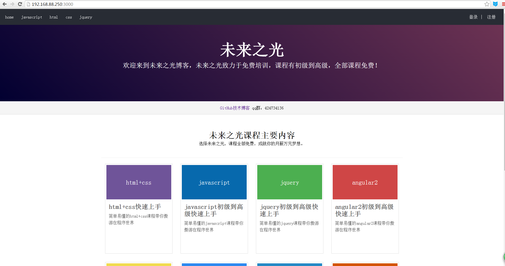
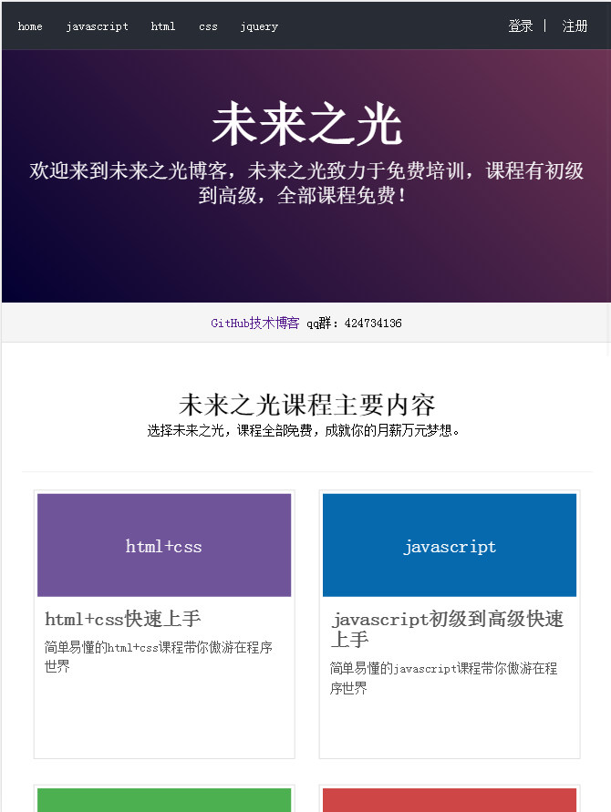
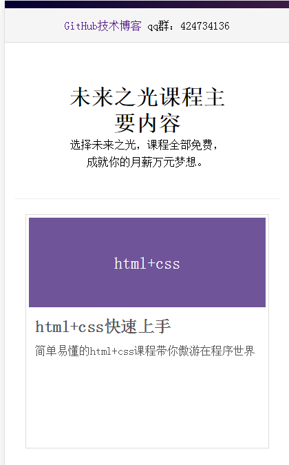

一.使用方法：
===================
  1.先下载shop文件夹 
  2.在windows+r进入命令行输入npm install --save-dev 
  3.然后输入npm start启动项目 
  4.在浏览器输入你的localhost:3000就会看到官网首页。 
  5.本网站兼容手机端; 
  6.如果遇到任何问题请加群：424734136我们会解答您的问题 
二.实现技术:
====================
  1.node 
  2.angular2 
  3.less 
  4.gulp 
  5.mongodb 
  6.jquery 
  7.ajax 
  8.npm 
  9.ejs 
  10.响应式 
  11.html5 
  12.css3 
三.环境
=============================
  1.npm这个是必须环境 
  2.node 
四.首页图片展示
================
  pc端截图
 
 ipad截图
 
 手机端截图
 